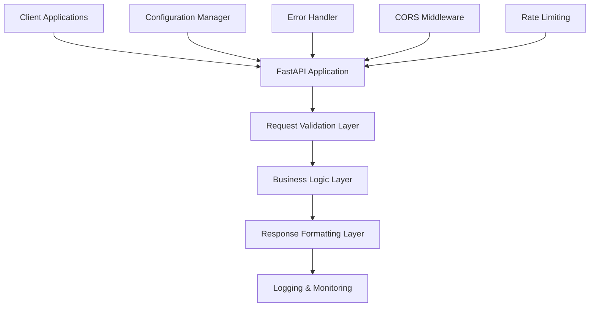

# Design Document

## Overview

The Candidate Filtering API is designed as a robust, production-ready FastAPI service that extends the existing functionality while adding comprehensive error handling, validation, logging, and testing capabilities. The design maintains backward compatibility while introducing enterprise-grade features for integration into larger systems.

## Architecture

### High-Level Architecture



### Layer Responsibilities

1. **Request Validation Layer**: Validates input data, handles type conversion, and enforces business rules
2. **Business Logic Layer**: Processes filter criteria and applies business logic
3. **Response Formatting Layer**: Ensures consistent response format across all endpoints
4. **Configuration Manager**: Handles environment-specific settings
5. **Error Handler**: Provides consistent error responses and logging

## Components and Interfaces

### Core Models

#### Enhanced Request Model
```python
class CandidateFilterRequest(BaseModel):
    name: Optional[str] = None
    skills: Optional[List[str]] = None
    optionalSkills: Optional[List[str]] = None
    instituteName: Optional[List[str]] = None
    course: Optional[List[str]] = None
    minExperience: Optional[int] = Field(None, ge=0, le=50)
    maxExperience: Optional[int] = Field(None, ge=0, le=50)
    phoneNumber: Optional[str] = Field(None, regex=r'^\+?[\d\s\-\(\)]+$')
    email: Optional[str] = Field(None, regex=r'^[^@]+@[^@]+\.[^@]+$')
    companyName: Optional[List[str]] = None
    
    @validator('maxExperience')
    def validate_experience_range(cls, v, values):
        if v is not None and 'minExperience' in values and values['minExperience'] is not None:
            if v < values['minExperience']:
                raise ValueError('maxExperience must be greater than or equal to minExperience')
        return v
```

#### Response Models
```python
class ExperienceRange(BaseModel):
    min: Optional[int] = None
    max: Optional[int] = None

class CandidateFilter(BaseModel):
    name: str = ""
    skills: List[str] = []
    optionalSkills: List[str] = []
    instituteName: List[str] = []
    course: List[str] = []
    experience: ExperienceRange = ExperienceRange()
    phoneNumber: str = ""
    email: str = ""
    companyName: List[str] = []

class APIResponse(BaseModel):
    success: bool
    data: Optional[CandidateFilter] = None
    message: str = ""
    errors: Optional[List[str]] = None
```

### Service Layer

#### Filter Service
```python
class CandidateFilterService:
    def process_filter_request(self, request: CandidateFilterRequest) -> CandidateFilter:
        """Process and validate filter request, applying business logic"""
        
    def validate_business_rules(self, request: CandidateFilterRequest) -> List[str]:
        """Validate business-specific rules and return any errors"""
        
    def sanitize_inputs(self, request: CandidateFilterRequest) -> CandidateFilterRequest:
        """Clean and sanitize input data"""
```

#### Configuration Service
```python
class ConfigService:
    def __init__(self):
        self.environment = os.getenv('ENVIRONMENT', 'development')
        self.cors_origins = self._get_cors_origins()
        self.rate_limit = self._get_rate_limit()
        
    def _get_cors_origins(self) -> List[str]:
        """Get CORS origins based on environment"""
        
    def _get_rate_limit(self) -> int:
        """Get rate limit based on environment"""
```

### Middleware Components

#### Error Handling Middleware
- Global exception handler for unhandled errors
- Validation error formatter
- Custom error response structure
- Error logging with request context

#### Logging Middleware
- Request/response logging
- Performance metrics collection
- Error tracking
- Audit trail for compliance

#### Rate Limiting Middleware
- Request rate limiting per IP
- Configurable limits based on environment
- Graceful degradation under load

## Data Models

### Input Validation Rules

1. **Experience Fields**:
   - Must be non-negative integers
   - Maximum value of 50 years
   - minExperience ≤ maxExperience when both provided

2. **Contact Information**:
   - Email: Valid email format validation
   - Phone: International phone number format support

3. **Array Fields**:
   - Skills, institutions, courses, companies: Non-empty strings only
   - Automatic deduplication and trimming

4. **String Fields**:
   - Name, email, phone: Trimmed whitespace
   - Maximum length limits for security

### Response Structure

All API responses follow a consistent structure:
```json
{
    "success": true,
    "data": {
        // CandidateFilter object
    },
    "message": "Request processed successfully",
    "errors": null
}
```

Error responses:
```json
{
    "success": false,
    "data": null,
    "message": "Validation failed",
    "errors": ["minExperience must be less than maxExperience"]
}
```

## Error Handling

### Error Categories

1. **Validation Errors (HTTP 422)**:
   - Invalid data types
   - Failed field validation
   - Business rule violations

2. **Client Errors (HTTP 400)**:
   - Malformed requests
   - Missing required headers

3. **Server Errors (HTTP 500)**:
   - Unexpected application errors
   - Database connection issues
   - External service failures

4. **Rate Limiting (HTTP 429)**:
   - Too many requests from single IP
   - Quota exceeded

### Error Response Format

```python
class ErrorResponse(BaseModel):
    success: bool = False
    message: str
    errors: Optional[List[str]] = None
    error_code: Optional[str] = None
    timestamp: datetime
    request_id: str
```

### Logging Strategy

- **Info Level**: Successful requests, configuration changes
- **Warning Level**: Validation failures, rate limiting
- **Error Level**: Server errors, external service failures
- **Debug Level**: Detailed request/response data (development only)

## Testing Strategy

### Unit Testing

1. **Model Validation Tests**:
   - Test all Pydantic model validations
   - Edge cases for experience ranges
   - Email and phone number format validation

2. **Service Layer Tests**:
   - Filter processing logic
   - Business rule validation
   - Input sanitization

3. **Utility Function Tests**:
   - Configuration loading
   - Error formatting
   - Data transformation utilities

### Integration Testing

1. **API Endpoint Tests**:
   - All valid request scenarios
   - All error scenarios
   - Edge cases and boundary conditions

2. **Middleware Tests**:
   - CORS functionality
   - Rate limiting behavior
   - Error handling flow

3. **End-to-End Tests**:
   - Complete request/response cycles
   - Multiple concurrent requests
   - Performance under load

### Test Data Strategy

1. **Valid Test Cases**:
   - Complete filter requests
   - Partial filter requests
   - Empty requests
   - Boundary value testing

2. **Invalid Test Cases**:
   - Invalid data types
   - Out-of-range values
   - Malformed email/phone
   - Invalid experience ranges

3. **Performance Test Cases**:
   - Large array inputs
   - Concurrent request handling
   - Memory usage patterns

### Testing Tools and Framework

- **pytest**: Primary testing framework
- **httpx**: Async HTTP client for API testing
- **pytest-asyncio**: Async test support
- **coverage.py**: Code coverage measurement
- **locust**: Load testing (optional)

### Continuous Integration

1. **Pre-commit Hooks**:
   - Code formatting (black, isort)
   - Linting (flake8, mypy)
   - Basic test execution

2. **CI Pipeline**:
   - Full test suite execution
   - Code coverage reporting
   - Security vulnerability scanning
   - Performance regression testing

## Production Readiness Features

### Configuration Management

- Environment-based configuration
- Secrets management
- Feature flags for gradual rollouts
- Runtime configuration updates

### Monitoring and Observability

1. **Health Checks**:
   - Basic health endpoint
   - Detailed health with dependencies
   - Readiness and liveness probes

2. **Metrics Collection**:
   - Request count and latency
   - Error rates by type
   - Resource utilization
   - Business metrics

3. **Distributed Tracing**:
   - Request correlation IDs
   - Performance bottleneck identification
   - Cross-service request tracking

### Security Considerations

1. **Input Validation**:
   - Comprehensive data validation
   - SQL injection prevention
   - XSS protection

2. **Rate Limiting**:
   - Per-IP request limits
   - Burst protection
   - Graceful degradation

3. **CORS Configuration**:
   - Environment-specific origins
   - Secure defaults
   - Credential handling

### Deployment Considerations

1. **Docker Support**:
   - Multi-stage builds
   - Security scanning
   - Minimal base images

2. **Environment Configuration**:
   - 12-factor app compliance
   - Secret injection
   - Configuration validation

3. **Scaling Considerations**:
   - Stateless design
   - Horizontal scaling support
   - Resource optimization